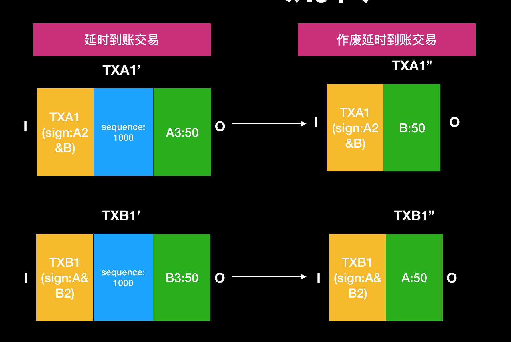

# 闪电网络
## 背景
比特币的交易网络最为人诟病的一点便是交易性能：全网每秒 7 笔的交易速度，远低于传统的金融交易系统；同时，等待 6 个块的可信确认导致约 1 个小时的最终确认时间。

## 目的
闪电网络的目的是实现安全快速地进行链下小额交易，从而提高交易处理速度

## 定义

闪电是一个分布式网络，通过哈希时间锁定智能合约以支持跨参与者网络的即时付款，同时利用区块链的特性消除将资金托管给第三方带来的风险。主要作为用于即时、高容量的微支付。

## 结构

1. RSMC（Recoverable Sequence Maturity Contract）
	
		保障了两个人之间的直接交易可以在链下完成
	
2. HTLC（Hashed Timelock Contract）

		保障了任意两个人之间的转账都可以通过一条“支付”通道来完成
		
## 特点

闪电网络允许网络中的所有参与者通过在节点之间找到一条路径，能够网络中上进行即时且廉价的交易。

> - 快速支付：
> - 无需可信第三方
> - 为区块链减负
> - 洋葱式路由
> - 具有多重签名功能
> - 跨链
> - 小额支付
> - 付款即时结算

## 原理解析

###  CLTV与CSV

闪电网络目前解决比特币交易处理速度慢，小额支付交易费过高的链下解决方案。因此闪电网络需要比特币底层支持。闪电网络是基于比特币脚本层的CLTV与CSV实现的。

- CLTV
	
		OP_CHECKLOCKTIMEVERIFY。它是对于nLockTime验证的script脚本。nLockTime是整笔交易的锁定时间，如果该交易未达到锁定时间是无法打入区块。nlocktime是一个绝对时间。
	
- CSV

		OP_CHECKSEQUENCEVERIFY。它是对于nSequence验证的script脚本。一笔交易的input交易在1000高度打包，nSequence=10，这笔交易只能在1010高度后被打包。nSequence是一个相对时间。
		
### 微支付通道

#### 1.描述

由于微支付通道是闪电网络基础，在解析闪电网络之前，需要先解析微支付通道的概念。

	如果买卖双方有大量的小额交易，微额交易，比如1个宽带提供商向外提供带宽服务，按小时付费。那大量的小额交易，不仅会让比特币网络负担沉重，而且手续费也不划算。

	有人就提出了，在买卖双方，建立1个支付通道，专门支持双方的小额支付，不需要经过比特币网络。这个通道除了建立、关闭的时候，要和比特币网络通信，其他时间，都是双方点到点的通信。

#### 2.例子

A为用户 B为数据提供商，A用100BTC购买B的100G的数据。但是不是一次到账而是分100次结算。如果是用传统转账产生的交易费是无法承受的。因此需要微支付通道。

#### 3.微支付通道建立

> 1. A组成一笔交易，输出到a&b多重签名地址。作为保证金交易（tx1）。tx1这时未被A签名。
> 2. A组成一笔退款交易，输入为tx1的输出，输出为a:100，并且带上nLockTime1(表示在锁定时间前该退款交易不能生效)。同时交给B签名，并B签名完成后。再对tx1进行签名。（A可保证如果交易未达成，也可退款）
> 3. 将tx1广播到网络中，tx1被打包后。说明通道被建立

#### 4.微支付通道流转

> 1. A收到B数据后，现在通道的分配需要修改为A:99 B:1。
> 2. 创建tx3，输入为tx1的输出,输出为A:99 B:1。nLockTime为900(每次locktime都要小于上一笔的locktime)
> 3. A再把这笔交易发个B,B签名后不广播。(如果B在未收到全部金额时，发现A作弊，可以发送已经分配的金额，获得B应得的金额。如果A发现B作弊,最多损失一部分金额。)
> 4. 循环123，最终通道分配方案为A:0 B:100 这是locktime为0说明交易可以立即被打包。

#### 5.微支付通道关闭

通道的关闭有三种情况:

> 1. 交易失败，A到期回收自己的保证金，广播tx1
> 2. 交易中途失败，B到期只能拿到自己已经获得的金额，广播tx3～tx101
> 3. 交易成功，B需要在tx1到期时间前广播最终交易tx102

#### 6.微支付通道优点

> 1. 解决小额支付，交易过多导致验证过慢，交易费过高的问题。
> 2. 解决线下支付双方不信任的问题，交易双方都不能作弊。A手上拿的有B的把柄，B手上拿的有A的把柄。任何1方中途中断，另我1方，把这个把柄广播到区块链网络，就可以执行合约，拿到属于自己的钱。

#### 7.微支付通道缺点

> 1. 通道是单向的
> 2. nLockTime的限制。假设B跑路了，A也要等到Refund Transaction的nLockTime到期了，才能拿回自己的钱；同样，假设A跑路了，B也要等到updated Transaction的nLockTime到期了，拿到属于自己的钱。

### RSMC通道

#### 1.定义

可撤销的顺序成熟度合同（Recoverable Sequence Maturity Contract）

#### 2.目的

> 1. 双向支付，而不是单通道 
> 2. 1方中途退出，另外1方要立即拿回钱，而不是等到时间到期才能拿回钱。 同时，应该对主动退出方实行惩罚。
> 3. 保证交易双方，任何1方都不能抵赖、反悔。

#### 3.RSMC通道创建

> 1. 同微支付通道一样首先A&B需要首先打一笔钱到A&B的公共账户中tx1
> 2. A&B都输入了保证金这是需要A&B创建自己的退款交易交给对方签名记为txa1，txb1，txa1’，txb1’。记为c1分配方案
> 3. txa1，txb1，txa1’，txb1’准备完成后，A&B在对tx1签名广播打包。

#### 4.RSMC通道流转

> 1. 当A&B发生资金周转时，A&B重新创建新的通道资金分配方案，txa2，txb2，txa2’，txb2’。记为c2分配方案
> 2. 这时c1与c2都有效，因此需要将前一种状态进行作废。如何作废。有两种方式：将txa1’（txb1’）延迟到账交易中输入A2（B2）私钥交给对方。或者创建一笔新的txa1’’（txb1’）交易交给对方，输出为对方地址。我们将该交易成为保证交易（表示我现在想变成新的交易状态，为了促进最新交易 我放弃之前的退款交易。如果我作弊那么你可以拿到我的钱）

#### 5.RSMC通道关闭

RSMC通道的关闭为当交易的一方广播通道的最后一个状态分配方案交易时，发送者一方延迟一段时间获得金额，另外一方立即获得金额。

### HTLC通道

#### 1.定义

带时钟的哈希锁定合约（ Hashed Timelock Contract）

#### 2.目的

> 1. 为未建立通道的双方提供安全的支付 

#### 3.浅析

当A给C转账时,需要通过与B的RSMC通道转给B金钱，然后B通过与C的RSMC通道转给C金钱。

如何保证当B收到金钱时,B一定转给C金钱。通过一个锁定脚本。只有B收到解锁脚本后B才能花费A转给B的金钱。从而实现A与C之间的HTLC通道。

#### 4.简例

A需要给C转1BTC。

1. C首先产生一个随机数R,然后hash(R),得到H，并把H交给A
2. A知道通过B可以转账，那么向B发出一笔交易，但是需要在规定时间内拿到正确计算出H的值的。超过规定时间A可以收回资金。
3. B这时向C发起一笔交易输出脚本，但是需要在规定时间内拿到正确计算出H的值的。超过规定时间B可以收回资金。

